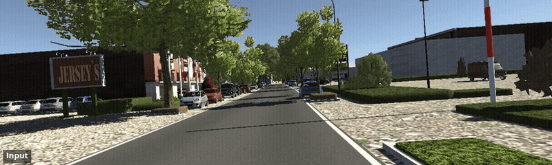

<div align="center">
<h1> ψ-PD: Wavelet Phase Diffusion for Structurally and Semantically Consistent Sim-to-Real Translation </h1>

Kaiwen Wang<sup>1</sup>, Frank Bieder<sup>2</sup>, Yinzhe Shen<sup>1</sup>, Carlos Fernandez<sup>1</sup>, Jan-Hendrik Pauls<sup>1</sup>, Omer Sahin Tas<sup>2</sup>

<sup>1</sup>*Karlsruhe Institute of Technology (KIT)* &nbsp;&nbsp;&nbsp; <sup>2</sup>*FZI Research Center for Information Technology*

[](https://kit-mrt.github.io/Wavelet-Phase-Diffusion/)&nbsp;
[](https://arxiv.org/abs/2607.21628)&nbsp;
[](https://huggingface.co/kaiwen-wang/Wavelet-Phase-Diffusion)
</div>

### Global Translation


### Instance-Level Translation *(only the highlighted region is translated)*


## Overview

Wavelet Phase Diffusion (**ψ-PD**) bridges the appearance gap in simulation-to-reality translation while strictly preserving structural and semantic consistency. By operating in the Dual-Tree Complex Wavelet Packet Transform (DT-ℂWPT) domain with Low-Frequency Randomization (LFR), ψ-PD achieves spatially localized phase injection without global spectral artifacts or architectural modifications. This localized formulation enables both global and instance-level sim-to-real translation for images and videos, significantly improving photorealism and downstream utility.

## Citation

```bibtex
@article{wang2026wavelet,
  title={Wavelet Phase Diffusion for Structurally and Semantically Consistent Sim-to-Real Translation},
  author={Wang, Kaiwen and Bieder, Frank and Shen, Yinzhe and Fernandez, Carlos and Pauls, Jan-Hendrik and Tas, Omer Sahin},
  journal={arXiv preprint arXiv:2607.21628},
  year={2026}
}
```

## License

Model weights are released under CC-BY-NC-4.0.
